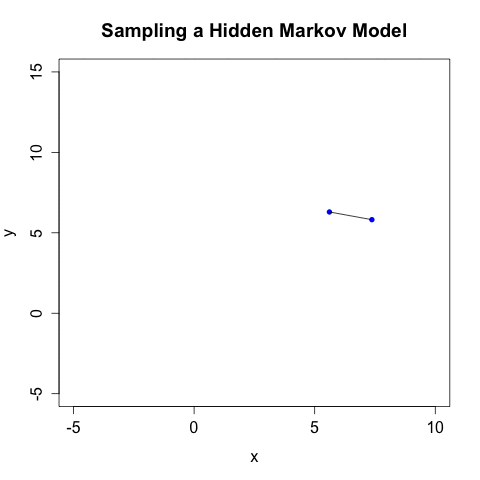

## Fun with the EM algorithm

This is home to some simulations and toy examples on the Expectation Maximization algorithm, and it's application to Gaussian Mixture Models and Hidden Markov Models.

### Expectation Maximization (EM)

Expectation Maximization (EM) is a neat algorithm used for learning probabilistic models with hidden variables, including HMMs and GMMs. At the heart of learning these models is a chicken-and-the-egg problem: if we knew the latent variables, we could estimate the model parameters, and vice versa. EM solves the problem by alterating between these two steps until convergence. 

### Gaussian Mixture Models (GMM)

Mixture model are a way to explain heterogeneity in the data through hidden variables. The classical example is the bimodal distribution for height in a population, which be modelled by a mixture of two normals (one for males, one for females).

Sampling from a mixture model is done in two steps:

1. Sample the hidden variable (i.e. flip a coin to see determine gender)
2. Sample from its emission distribution (i.e. the normal for males or the normal for females)

The samples are independent and identically distributed. This is what sampling looks like for a mixture of 3 bivariate Gaussians:

#### Hidden Markov Models (HMM)

Hidden Markov Models can be though of as generalizations of mixture models to where observations are related in time (i.e no longer independent). We assume that the the hidden variables form a [Markov Chain](http://en.wikipedia.org/wiki/Markov_chain). HMM have one more parameter than EMs - a transition matrix describing the probabilities of jumping between different states.

Sampling from HMMs is very similiar to mixture models - the only difference is that the distribution of the hidden variable depends on the previous state. Here is an example with the same parameters above and a diagonal-heavy transition matrix (0.8 on the diagonal, 0.1 on the off-diagonals):

With this HMM, there is only a 20% chance of leaving a state, so the system doesn't jump between states as often as before.

#### References

[Pattern Recognition and Machine Learning (Bishop)](http://www.amazon.com/Pattern-Recognition-Learning-Information-Statistics/dp/0387310738) -
examples are taken from this bible of machine learning Machine Learning.

#### Wishlist
- Create an R package with `Roxygen2` styles documentation
- Implement the Baum-Welch algorithm for fitting HMMs
